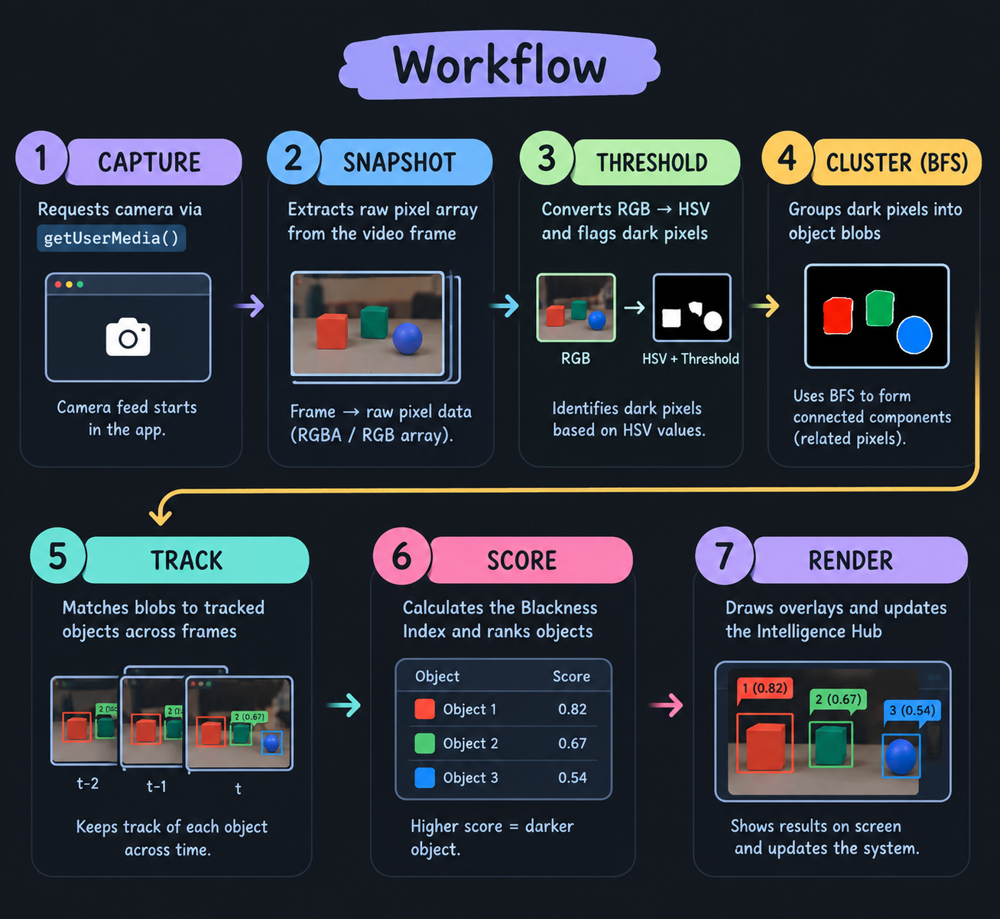

# [Project Name] 🎯

## Basic Details
### Team Name: Gabriel

### Team Members
- Team Lead: Akash Davis - Sreenarayana Gurukulam College Of Engineering

### Project Description
The project is a website that tracks objects with black shades and tells you the position along with the amount of darkness/blackness of the object 
### The Problem (that doesn't exist)
Am i being followed by a black monitor???

### The Solution (that nobody asked for)
The camera identifies the objects with different shades of black and compares it with the lighting to rank the object with the most premium black colour and tells you the position of the object

## Technical Details
### Technologies/Components Used
For Software:
- JavaScript (ES6+),CSS3,HTML5
- No special Framework used
- NO extra Libraries used
- Web Browser,Code Editor,ANtigravity,Chatgpt

For Hardware:
- [List main components]
- [List specifications]
- [List tools required]

### Implementation
For Software:
The software implementation of the site follows a specific pipeline to achieve real-time "Blackness Index" analysis:

Stream Acquisition: The system uses navigator.mediaDevices.getUserMedia() to request camera permissions and pipes the video stream into a hidden <video> element.
Frame Capture: Within a continuous requestAnimationFrame loop, the current frame from the video element is drawn onto an off-screen <canvas>.
Pixel Analysis (Thresholding): The system extracts the ImageData array from the canvas. It iterates through the pixels, converting RGB values to HSV (Hue, Saturation, Value) to evaluate brightness and color intensity. Pixels that fall below a specific brightness threshold are flagged as "dark."
Object Detection (Clustering): The system groups contiguous flagged pixels into distinct clusters using a grid-based connected-component algorithm.
Telemetry & Tracking: Each cluster is assigned a unique ID. The system calculates its center of mass, bounding box, and a proprietary "Blackness Index" based on the average pixel intensity within the cluster. It also tracks the object's movement between frames to calculate velocity.
UI Rendering: Finally, the system draws the main video frame to the visible canvas, overlays tactical brackets and tracking trails, and updates the DOM in the right-hand Intelligence Hub with the newly calculated telemetry data.
# Installation
[commands]

# Run
### 3 Options

1. `Direct browser open`
2. `Python http.server`
3. `Node npx serve`

### Project Documentation
For Software:

# Screenshots (Add at least 3)

*Shows The opening page of the website*

*Shows The Sroll down highlighting the objects*

*The screen after switching the backgroud ie new case*

# Diagrams

*1. Capture The browser requests your webcam feed and plays it silently in a hidden video tag.

2. Snapshot Up to 30 times a second, JavaScript grabs the current frame from the video and reads the color of every single pixel using an invisible HTML5 <canvas>.

3. Analyze (The Brain) JavaScript runs through all those pixels using your computer's processor. It finds the pixels that are "dark enough," groups them together into distinct objects, and calculates how black they are to generate the "Blackness Index."

4. Track It remembers where those dark objects were in the previous frame so it can track their movement, speed, and draw a trail behind them.

5. Render Finally, it draws the video frame onto the visible screen, draws the green tactical boxes over the dark objects it found, and updates the text in the right-hand panel with the latest stats.

This entire loop—Capture, Snapshot, Analyze, Track, Render—happens entirely on your local machine in a fraction of a second, over and over again, creating a real-time experience without needing a server.*

### Project Demo
# Video

*App functioning in live*

# Additional Demos
[Add any extra demo materials/links]

## Team Contributions
- Akash Davis: Everything

---
Made with ❤️ at TinkerHub Useless Projects 

